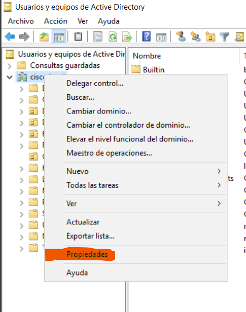
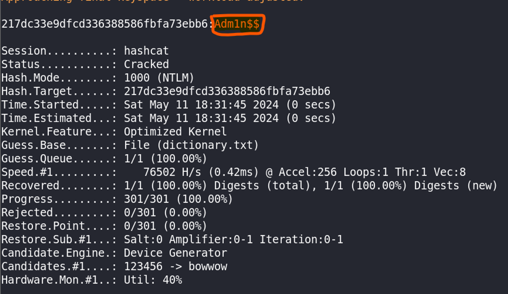

# DCSync

## ORIGEN DE EL DCSYNC

Para entender la vulnerabilidad DCSync primero debemos entender ¿Qué es MS-DRSR?. MS-DRSR (***Microsoft Domain Replication Service Remote***) es el protocolo utilizado en un entorno de Active Directory de replicación de la base de datos NTDS.

> *NTDS es el servicio que almacena información sobre usuarios, grupos, etc. incluyendo los hashes de las contraseñas de los usuarios.*
> 

Para que un DC (***Domain Controller***) repliquen la información de su base de datos NTDS en otro objeto de la red, por lo general un dominio, este objeto debe tener en las DACLs del dominio principal una ACE que indique que este objeto tendrá permisos de replicación, a estos permisos se les llama **DS-Replication-Get-Changes**, **DS-Replication-Get-Changes-In-Filtered-Set** y **DS-Replication-Get-Changes-All**. Con estos permisos aplicados a un objeto el Dominio compartirá la información de su base de datos NTDS para dicho objeto por medio al protocolo MS-DRSR.

Una vez entendiendo esto podemos comprender que si un usuario tuviera dichos permisos podría solicitar una petición para “replicar” la información de la base de datos NTDS y podría obtener los hashes de las contraseñas que más adelante podría crackear.

---

## PREPARACIÓN DEL ENTORNO

Para hacer que se produzca esta vulnerabilidad vamos a tomar un usuario cualquiera, sin importar si este tiene o no bajos privilegios, y vamos a darle los permisos de **DS-Replication-Get-Changes**, **DS-Replication-Get-Changes-In-Filtered-Set** y **DS-Replication-Get-Changes-All**.

Así que vamos a dirigirnos a nuestro ***Administrador del Servidor > Herramientas > Usuarios y equipos de Active Directory***, una vez allí en el menú lateral izquierdo hacemos click derecho sobre nuestro dominio y damos click sobre propiedades.



Una vez en las propiedades damos click donde dice ***Seguridad*** y luego en el boton de ***Agregar***.


En la nueva ventana emergente que se abre agregamos el objeto al que queremos darle los privilegios y damos click en ***Aceptar***.


Por último, seleccionamos nuestro usuario, le permitimos los siguientes permisos y aplicamos los cambios.


Con esto la vulnerabilidad está presente en la red del dominio.

---

## EXPLOTACIÓN

Si de alguna manera logramos vulnerar al usuario **daniele.ethelind** desde allí podríamos realizar la petición de la base de datos NTDS al Domain Controller y así dumpear toda la base de datos NTDS y obtener cualquier hash NTLM de cualquier usuario, incluyento de usuarios administradores.

### Desde Linux con `impacket` .

Usaremos el módulo **`*secretsdump*`** de **`*impacket`*** de la siguiente manera:

```bash
impacket-secretsdump -just-dc [domain]/[user]:[password]@[dc-ip]
```

**`*-just-dc*`** extrae los hashes NTLM y hashes de Kerberos del fichero NTDS.DIT. Luego indicamos el ***dominio***, el ***usuario***, la ***contraseña*** de dicho usuario y la ***IP de Domain Controller***. Un ejemplo de uso es el siguiente:

```bash
impacket-secretsdump -just-dc cisco.local/daniele.ethelind:D3thelind@192.168.56.136
```

El resultado es el siguiente:


### Desde Windows con `mimikatz` .

Si tenemos una máquina Windows agregada al dominio e iniciamos sesión con el usuario previamente vulnerado. Ahora solo nos dirigimos al navegador y pegamos el siguiente enlace [[https://github.com/ParrotSec/mimikatz/tree/master/x64](https://github.com/ParrotSec/mimikatz/tree/master/x64)] y nos descargamos el ***mimikatz.exe***.


> *Es probable que el Firewall detecte este binario como un software malisioso, por ende, es recomendable desactivarlo para fines didacticos.*
> 

Abrimos una powershell, nos dirigimos al directorio donde se descargó el binario y lo ejecutamos de la siguiente manera:


Se nos va a ejecutar una consola interactiva en la cual vamos a llamar al siguiente comando:

```bash
lsadump::dcsync /user:[DOMAIN]\[USER_TO_DUMP]
```

En mi caso:

```bash
lsadump::dcsync /user:cisco\Administrador
```

Y así obtuvimos el hash NTLM del usuario Administrador desde un usuario sin privilegios pero, con permisos para obtener una copia de la base de datos NTDS del dominio.


---

## CRACKEO DE LOS HASHES ENCONTRADOS

Como podemos ver ya podríamos guardar los hashes e intentar crackearlos de manera offline. En mi caso voy a mostrar como crackeo con **`*hashcat*`** el hash del usuario Administrador que es el primero que aparece en la imagen.

Primero vamos a introducir el hash en un archivo y con el siguiente comando vamos a crackear el hash.

```bash
hashcat -a 0 -m 1000 *HASH_FILE* *DICTIONARY_FILE -O*
```

En mi caso:

```bash
hashcat -a 0 -m 1000 admin.hash dictionary.txt -O
```

Y como resultado obtenemos la contraseña crackeada.

